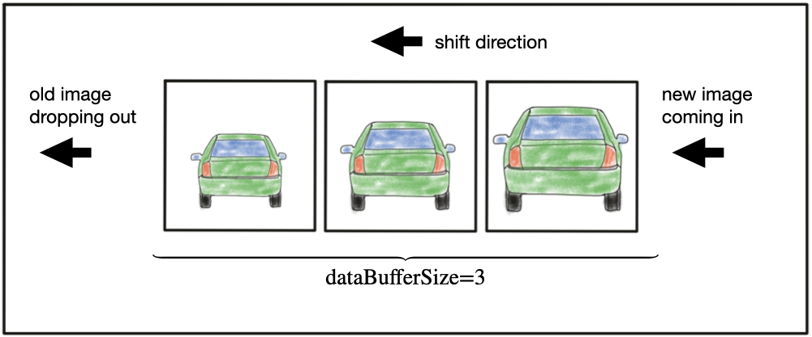

# SFND 2D Feature Tracking


## Dependencies for Running Locally
1. cmake >= 2.8
 * All OSes: [click here for installation instructions](https://cmake.org/install/)

2. make >= 4.1 (Linux, Mac), 3.81 (Windows)
 * Linux: make is installed by default on most Linux distros
 * Mac: [install Xcode command line tools to get make](https://developer.apple.com/xcode/features/)
 * Windows: [Click here for installation instructions](http://gnuwin32.sourceforge.net/packages/make.htm)

3. OpenCV >= 4.1
 * All OSes: refer to the [official instructions](https://docs.opencv.org/master/df/d65/tutorial_table_of_content_introduction.html)
 * This must be compiled from source using the `-D OPENCV_ENABLE_NONFREE=ON` cmake flag for testing the SIFT and SURF detectors. If using [homebrew](https://brew.sh/): `$> brew install --build-from-source opencv` will install required dependencies and compile opencv with the `opencv_contrib` module by default (no need to set `-DOPENCV_ENABLE_NONFREE=ON` manually). 
 * The OpenCV 4.1.0 source code can be found [here](https://github.com/opencv/opencv/tree/4.1.0)

4. gcc/g++ >= 5.4
  * Linux: gcc / g++ is installed by default on most Linux distros
  * Mac: same deal as make - [install Xcode command line tools](https://developer.apple.com/xcode/features/)
  * Windows: recommend using either [MinGW-w64](http://mingw-w64.org/doku.php/start) or [Microsoft's VCPKG, a C++ package manager](https://docs.microsoft.com/en-us/cpp/build/install-vcpkg?view=msvc-160&tabs=windows). VCPKG maintains its own binary distributions of OpenCV and many other packages. To see what packages are available, type `vcpkg search` at the command prompt. For example, once you've _VCPKG_ installed, you can install _OpenCV 4.1_ with the command:
```bash
c:\vcpkg> vcpkg install opencv4[nonfree,contrib]:x64-windows
```
Then, add *C:\vcpkg\installed\x64-windows\bin* and *C:\vcpkg\installed\x64-windows\debug\bin* to your user's _PATH_ variable. Also, set the _CMake Toolchain File_ to *c:\vcpkg\scripts\buildsystems\vcpkg.cmake*.


## Basic Build Instructions

1. Clone this repo.
2. Make a build directory in the top level directory: `mkdir build && cd build`
3. Compile: `cmake .. && make`

## Run It
1. Run the project manually: `./2D_feature_tracking <DetType> <DescType>`. Replace the <DetType> <DescType> with detector and descriptor types, respectively.
2. Run the project via the bash script: `chmod +x scripts/run_project.sh && ./scripts/run_project.sh`. Also, it will handle parameter passing and show an output checking whether the passed parameter(s) is/are invalid.
3. Run the test manually: `./test <DetType> <DescType>`. 
4. Run the test via the bash script: `chmod +x scripts/run_test.sh && ./scripts/run_test.sh`. The test program will only show the point sizes and duration for each iteration, including all the available descriptor and detector combinations, only visualizing the last step.

### Note
- DesType arguments are: SHITOMASI HARRIS FAST BRISK ORB AKAZE SIFT
- DetType arguments are: BRIEF ORB FREAK AKAZE SIFT
- If the `<DetType>` and `<DescType>` parameters are not passed to the project and test programs/scripts, the program will default to using the ORB detector and FREAK descriptor. If the `<DescType>` parameter is not passed, the program will default to using the FREAK descriptor.
- The test script will try all the combinations, even if some of them are incompatible. To deal with these errors, modify err_handle to true in the main function; this will use the default detector and descriptor methods rather than the passed incompatible arguments.

## Project Steps

### MP.1 Data Buffer Optimization

For analysis with the constant velocity assumption, the data buffer size is set to 2. If the data buffer vector is full after a new image acquisition, the oldest element is removed from the vector, and the newly acquired image is added at the end.

```cpp
        DataFrame frame;
        frame.cameraImg = imgGray;
        if(imgIndex > (dataBufferSize - 1))
            dataBuffer.erase(dataBuffer.begin());
        dataBuffer.push_back(frame);
```


### MP.2 Keypoint Detection

This project uses the following methods to detect keypoints from images:
- Shi-Tomasi
- Harris
- FAST (Features from Accelerated Segment Test)
- BRISK (Binary Robust Invariant Scalable Keypoints)
- ORB (Oriented FAST and Rotated BRIEF)
- AKAZE (Accelerated-KAZE)
- SIFT (Scale-Invariant Feature Transform)

```cpp
        if (detectorType.compare("SHITOMASI") == 0)
        {
            detKeypointsShiTomasi(keypoints, imgGray, false);
        }
        else
        {
            if(detectorType.compare("HARRIS") == 0)
                detKeypointsHarris(keypoints, imgGray, false);
            else
                detKeypointsModern(keypoints, imgGray, detectorType, false);
        }
```

### MP.3 Keypoint Removal

A rectangle was defined to select the area encapsulating the preceding car, and the keypoints remaining outside the rectangle were removed.

```cpp
        bool bFocusOnVehicle = true;
        cv::Rect vehicleRect(535, 180, 180, 150);
        if (bFocusOnVehicle)
        {
            vector<cv::KeyPoint> rect_kpts;
            for(auto &itr : keypoints)
            {
                if(vehicleRect.contains(itr.pt)) 
                    rect_kpts.push_back(itr);
            }
            keypoints.clear();
            keypoints = rect_kpts;
        }
```
### MP.4 Keypoint Descriptors

The descriptor type was selected manually and passed into the __descKeypoints()__ function.

```cpp
        cv::Mat descriptors;
        string descriptorType = "BRIEF";
        descKeypoints((dataBuffer.end() - 1)->keypoints, (dataBuffer.end() - 1)->cameraImg, descriptors, descriptorType);
```      

### MP.5 Descriptor Matching

The following methods are used as descriptor types:
- BRIEF 
- ORB
- FREAK
- AKAZE
- SIFT

```cpp
#if CV_VERSION_MAJOR > 4 || (CV_VERSION_MAJOR == 4 && CV_VERSION_MINOR > 4)
    #define OPENCV_VERSION_GE_4_4
#endif

void descKeypoints(vector<cv::KeyPoint> &keypoints, cv::Mat &img, cv::Mat &descriptors, string descriptorType)
{
    // select appropriate descriptor
    cv::Ptr<cv::DescriptorExtractor> extractor;
    double t = (double)cv::getTickCount();

    if (descriptorType.compare("BRISK") == 0)
    {

        int threshold = 30;        // FAST/AGAST detection threshold score.
        int octaves = 3;           // detection octaves (use 0 to do single scale)
        float patternScale = 1.0f; // apply this scale to the pattern used for sampling the neighbourhood of a keypoint.

        extractor = cv::BRISK::create(threshold, octaves, patternScale);
    }
    else
    {
        //// -> BRIEF, ORB, FREAK, AKAZE, SIFT
        if(descriptorType.compare("BRIEF") == 0)
        {
            extractor = cv::xfeatures2d::BriefDescriptorExtractor::create();
        }
        else if(descriptorType.compare("ORB") == 0)
        {
            extractor = cv::ORB::create();
        }
        else if(descriptorType.compare("FREAK") == 0)
        {
            extractor = cv::xfeatures2d::FREAK::create();
        }
        else if(descriptorType.compare("AKAZE") == 0)
        {
            extractor = cv::AKAZE::create();
            t = (double)cv::getTickCount();
            extractor->compute(img, keypoints, descriptors);
            t = ((double)cv::getTickCount() - t) / cv::getTickFrequency();
        }
        else if(descriptorType.compare("SIFT") == 0)
        {
#ifdef OPENCV_VERSION_GE_4_4
            extractor = cv::SIFT::create();
#else
            extractor = cv::xfeatures2d::SIFT::create();
#endif
        }
    }

    // perform feature description
    if(descriptorType.compare("AKAZE") != 0)
    {
        t = (double)cv::getTickCount();
        extractor->compute(img, keypoints, descriptors);
        t = ((double)cv::getTickCount() - t) / cv::getTickFrequency();
    }
    
    cout << descriptorType << " descriptor extraction in " << 1000 * t / 1.0 << " ms" << endl;
}
```

### MP.6 Descriptor Distance Ratio

Brute-force matching is used with the NN (nearest neighbor) matching task. Depending on the descriptor type, it is used with either Hamming-norm, which is compatible with binary descriptors (ORB, BRISK, and BRIEF), or L2-norm, which is compatible with HOG descriptors (SIFT). FLANN matching is the alternative to brute-force matching and is used with KNN (K-Nearest Neighbor) matching tasks.

```cpp
void matchDescriptors(std::vector<cv::KeyPoint> &kPtsSource, std::vector<cv::KeyPoint> &kPtsRef, cv::Mat &descSource, cv::Mat &descRef,
                      std::vector<cv::DMatch> &matches, std::string descriptorType, std::string matcherType, std::string selectorType)
{
	// Configure the matcher
    bool crossCheck = false;
    cv::Ptr<cv::DescriptorMatcher> matcher;
    cv::FlannBasedMatcher flann_matcher(new cv::flann::LshIndexParams(20, 10, 20));

    if (matcherType.compare("MAT_BF") == 0)
    {
        int normType = descriptorType.compare("DES_HOG") == 0 ? cv::NORM_L2 : cv::NORM_HAMMING;
        matcher = cv::BFMatcher::create(normType, crossCheck);
    }
    else if (matcherType.compare("MAT_FLANN") == 0)
    {   
        cout << "FLANN matching" << endl;     
    }

    // Perform the matching task
    if (selectorType.compare("SEL_NN") == 0)
    { // nearest neighbor (best match)
        matcher->match(descSource, descRef, matches); // Finds the best match for each descriptor in desc1
    }
    else if (selectorType.compare("SEL_KNN") == 0)
    { // k nearest neighbors (k=2)
        const int k_size = 2;
        std::vector<std::vector<cv::DMatch>> knn_matches;
        if(matcherType.compare("MAT_FLANN") == 0)
            flann_matcher.knnMatch(descSource, descRef, knn_matches, k_size);
        else
            matcher->knnMatch(descSource, descRef, knn_matches, k_size);
        // Filter matches by using descriptor distance ratio test
        const float rat_thr = 0.8f;
        int rem_pts = 0;
        for (size_t i = 0; i < knn_matches.size(); i++)
        {
            if (knn_matches[i][0].distance < rat_thr * knn_matches[i][1].distance)
                matches.push_back(knn_matches[i][0]);
            else
                rem_pts += 1;
        }
    }
}
```

### MP.7 - MP.9 Performance Evaluation

As a result, the AKAZE descriptor could be run only with the AKAZE detector. Also, the SIFT keypoint detector wasn't compatible with the ORB detector.

Orientations were obtained with the SIFT, BRIEF, ORB, and AKAZE keypoint detectors. The SIFT keypoint detector took longer than other methods, so this method isn't practical for real-time applications. Also, some keypoint matching errors were observed, which is another drawback of this detector. The AKAZE and BRIEF keypoint detectors did well and are valid for real-time applications, but the ORB keypoint detector is a better choice for rapid applications that need orientations. The AKAZE and BRIEF keypoint detectors obtained more keypoints than the ORB keypoint detector. The AKAZE, BRIEF, and ORB keypoint detectors produced less error than the SIFT keypoint detector. The first keypoint detection process via the ORB keypoint detector takes longer than the following processes, which is a disadvantage of this method.

The Shi-Tomasi, Harris, and FAST detectors obtain no orientation. Shi-Tomasi keypoint detector detected keypoints with few errors. The Harris detector detected fewer keypoints with no errors, while the FAST keypoint detector detected keypoints swiftly with few errors.

The top 3 Detectors-Descriptors are:
- BRISK-BRIEF (Detecting keypoints with orientation, many keypoints)
- ORB-BRIEF (Detecting keypoint with orientation, less process time)
- FAST-BRIEF (Detecting keypoints without orientation, less process time)

<table cellspacing="0" border="0">
	<colgroup width="112"></colgroup>
	<colgroup width="80"></colgroup>
	<colgroup width="85"></colgroup>
	<colgroup span="2" width="495"></colgroup>
	<colgroup span="3" width="463"></colgroup>
	<tr>
		<td colspan=3 height="26" align="center" valign=middle><b><font face="Liberation Serif,Times New Roman" size=4>Detector/Descriptor</font></b></td>
		<td style="border-top: 3px solid #000000; border-bottom: 3px solid #000000; border-left: 3px solid #000000; border-right: 1px solid #000000" align="center"><b><font face="Liberation Serif,Times New Roman" size=3>BRIEF</font></b></td>
		<td style="border-top: 3px solid #000000; border-bottom: 3px solid #000000; border-left: 1px solid #000000; border-right: 1px solid #000000" align="center"><b><font face="Liberation Serif,Times New Roman" size=3>ORB</font></b></td>
		<td style="border-top: 3px solid #000000; border-bottom: 3px solid #000000; border-left: 1px solid #000000; border-right: 1px solid #000000" align="center"><b><font face="Liberation Serif,Times New Roman" size=3>FREAK</font></b></td>
		<td style="border-top: 3px solid #000000; border-bottom: 3px solid #000000; border-left: 1px solid #000000; border-right: 1px solid #000000" align="center"><b><font face="Liberation Serif,Times New Roman" size=3>SIFT</font></b></td>
		<td style="border-top: 3px solid #000000; border-bottom: 3px solid #000000; border-left: 1px solid #000000; border-right: 3px solid #000000" align="center"><b><font face="Liberation Serif,Times New Roman" size=3>AKAZE</font></b></td>
	</tr>
	<tr>
		<td style="border-top: 3px solid #000000; border-bottom: 3px solid #000000; border-left: 3px solid #000000; border-right: 1px solid #000000" rowspan=4 height="80" align="center" valign=middle><b><font face="Liberation Serif,Times New Roman" size=3>SHI-TOMASI</font></b></td>
		<td style="border-top: 3px solid #000000; border-bottom: 1px solid #000000; border-left: 3px solid #000000; border-right: 3px solid #000000" rowspan=2 align="center" valign=middle><font face="Liberation Serif,Times New Roman" size=3>n<sub>1-10</sub> (kpts)</font></td>
		<td style="border-top: 3px solid #000000; border-bottom: 1px solid #000000; border-right: 1px solid #000000" rowspan=3 align="center" valign=middle><font face="Liberation Serif,Times New Roman" size=3>Detector</font></td>
		<td style="border-top: 3px solid #000000; border-right: 1px solid #000000" colspan=4 align="center" valign=middle><font face="Liberation Serif,Times New Roman" size=3>{1370, 1301, 1361, 1358, 1333, 1284, 1322, 1366, 1389, 1339}</font></td>
		<td style="border-top: 3px solid #000000; border-bottom: 3px solid #000000; border-right: 3px solid #000000" rowspan=4 align="center" valign=middle bgcolor="#E16173">(-215:Assertion failed) 0 &lt;= kpts[i].class_id &amp;&amp; kpts[i].class_id &lt; static_cast&lt;int&gt;(evolution_.size()) in function 'Compute_Descriptors'</td>
	</tr>
	<tr>
		<td style="border-top: 3px solid #000000; border-bottom: 3px solid #000000; border-right: 1px solid #000000" colspan=4 align="center" valign=middle><font face="Liberation Serif,Times New Roman" size=3>{125, 118, 123, 120, 120, 113, 114, 123, 111, 112}</font></td>
		</tr>
	<tr>
		<td style="border-bottom: 3px solid #000000; border-left: 3px solid #000000; border-right: 3px solid #000000" rowspan=2 align="center" valign=middle><font face="Liberation Serif,Times New Roman" size=3>t<sub>1-10</sub> (ms)</font></td>
		<td style="border-top: 1px solid #000000; border-bottom: 1px solid #000000; border-left: 1px solid #000000; border-right: 1px solid #000000" align="center" valign=middle><font face="Liberation Serif,Times New Roman" size=3>{10.38, 9.86, 9.21, 8.51, 8.91, 8.24, 8.32, 8.22, 8.24, 8.21}</font></td>
		<td style="border-top: 1px solid #000000; border-bottom: 1px solid #000000; border-left: 1px solid #000000; border-right: 1px solid #000000" align="center" valign=middle>{10.65, 9.65, 9.89, 8.59, 9.54, 8.60, 8.49, 8.42, 8.28, 8.38}</td>
		<td style="border-top: 1px solid #000000; border-bottom: 1px solid #000000" align="center" valign=middle>{10.66, 8.83, 6.58, 6.66, 6.25, 6.27, 6.23, 6.23, 6.25, 6.30}</td>
		<td style="border-top: 1px solid #000000; border-bottom: 1px solid #000000; border-left: 1px solid #000000; border-right: 1px solid #000000" align="center" valign=middle>{11.60, 8.44, 9.96, 9.49, 9.32, 10.40, 11.49, 9.75, 9.22, 9.00}</td>
		</tr>
	<tr>
		<td style="border-bottom: 3px solid #000000; border-right: 1px solid #000000" align="center" valign=middle><font face="Liberation Serif,Times New Roman" size=3>Descriptor</font></td>
		<td style="border-bottom: 1px solid #000000; border-left: 1px solid #000000; border-right: 1px solid #000000" align="center" valign=middle><font face="Liberation Serif,Times New Roman" size=3>{0.74, 0.72, 0.63, 0.70, 0.70, 0.63, 0.61, 0.69, 0.67, 0.62}</font></td>
		<td style="border-bottom: 1px solid #000000; border-left: 1px solid #000000; border-right: 1px solid #000000" align="center" valign=middle>{2.01, 2.14, 2.32, 2.01, 1.92, 1.89, 1.87, 1.89, 1.86, 1.87}</td>
		<td style="border-bottom: 1px solid #000000" align="center" valign=middle>{19.68, 16.51, 16.53, 16.17, 16.00, 16.05, 15.96, 16.00, 16.10, 15.96}</td>
		<td style="border-bottom: 1px solid #000000; border-left: 1px solid #000000; border-right: 1px solid #000000" align="center" valign=middle>{13.65, 13.68, 12.76, 11.27, 11.22, 17.98, 16.62, 11.44, 10.35, 10.48}</td>
		</tr>
	<tr>
		<td style="border-top: 3px solid #000000; border-bottom: 3px solid #000000; border-left: 3px solid #000000; border-right: 1px solid #000000" rowspan=4 height="80" align="center" valign=middle><b><font face="Liberation Serif,Times New Roman" size=3>HARRIS</font></b></td>
		<td style="border-top: 3px solid #000000; border-bottom: 1px solid #000000; border-left: 3px solid #000000; border-right: 3px solid #000000" rowspan=2 align="center" valign=middle><font face="Liberation Serif,Times New Roman" size=3>n<sub>1-10</sub> (kpts)</font></td>
		<td style="border-top: 3px solid #000000; border-bottom: 1px solid #000000; border-right: 1px solid #000000" rowspan=3 align="center" valign=middle><font face="Liberation Serif,Times New Roman" size=3>Detector</font></td>
		<td style="border-top: 3px solid #000000" colspan=4 align="center" valign=middle><font face="Liberation Serif,Times New Roman" size=3>{115, 98, 113, 121, 160, 383, 85, 210, 171, 281}</font></td>
		<td style="border-top: 3px solid #000000; border-bottom: 3px solid #000000; border-left: 1px solid #000000; border-right: 3px solid #000000" rowspan=4 align="center" valign=middle bgcolor="#E16173">(-215:Assertion failed) 0 &lt;= kpts[i].class_id &amp;&amp; kpts[i].class_id &lt; static_cast&lt;int&gt;(evolution_.size()) in function 'Compute_Descriptors'</td>
	</tr>
	<tr>
		<td style="border-top: 3px solid #000000; border-bottom: 3px solid #000000" colspan=4 align="center" valign=middle><font face="Liberation Serif,Times New Roman" size=3>{17, 14, 18, 21, 26, 43, 18, 31, 26, 34}</font></td>
		</tr>
	<tr>
		<td style="border-bottom: 3px solid #000000; border-left: 3px solid #000000; border-right: 3px solid #000000" rowspan=2 align="center" valign=middle><font face="Liberation Serif,Times New Roman" size=3>t<sub>1-10</sub> (ms)</font></td>
		<td style="border-top: 1px solid #000000; border-bottom: 1px solid #000000; border-left: 1px solid #000000; border-right: 1px solid #000000" align="center" valign=middle><font face="Liberation Serif,Times New Roman" size=3>{7.78, 6.37, 6.47, 7.05, 6.61, 6.52, 7.29, 7.02, 6.55, 6.52}</font></td>
		<td style="border-top: 1px solid #000000; border-bottom: 1px solid #000000" align="center" valign=middle>{7.57, 6.78, 6.43, 7.54, 6.72, 6.45, 6.52, 7.23, 6.42, 6.36}</td>
		<td style="border-top: 1px solid #000000; border-bottom: 1px solid #000000; border-left: 1px solid #000000; border-right: 1px solid #000000" align="center" valign=middle>{8.23, 6.86, 5.78, 5.14, 5.12, 5.21, 4.84, 4.67, 4.59, 4.74}</td>
		<td style="border-top: 1px solid #000000; border-bottom: 1px solid #000000; border-right: 1px solid #000000" align="center" valign=middle>{13.29, 5.75, 10.87, 7.19, 7.37, 7.33, 7.08, 6.55, 5.95, 5.91}</td>
		</tr>
	<tr>
		<td style="border-bottom: 3px solid #000000; border-right: 1px solid #000000" align="center" valign=middle><font face="Liberation Serif,Times New Roman" size=3>Descriptor</font></td>
		<td style="border-bottom: 1px solid #000000; border-left: 1px solid #000000; border-right: 1px solid #000000" align="center" valign=middle><font face="Liberation Serif,Times New Roman" size=3>{0.19, 0.53, 0.53, 0.58, 0.59, 0.59, 0.57, 0.61, 0.61, 0.56}</font></td>
		<td style="border-bottom: 1px solid #000000" align="center" valign=middle>{1.91, 1.98, 2.25, 2.37, 1.98, 1.99, 1.99, 2.42, 1.98, 1.98}</td>
		<td style="border-bottom: 1px solid #000000; border-left: 1px solid #000000; border-right: 1px solid #000000" align="center" valign=middle>{20.38, 17.92, 17.51, 19.15, 19.05, 16.97, 15.74, 15.62, 15.58, 15.61}</td>
		<td style="border-bottom: 1px solid #000000; border-right: 1px solid #000000" align="center" valign=middle>{11.01, 11.46, 13.25, 12.58, 12.40, 12.81, 15.15, 10.83, 10.26, 10.19}</td>
		</tr>
	<tr>
		<td style="border-top: 3px solid #000000; border-bottom: 3px solid #000000; border-left: 3px solid #000000; border-right: 1px solid #000000" rowspan=4 height="80" align="center" valign=middle><b><font face="Liberation Serif,Times New Roman" size=3>FAST</font></b></td>
		<td style="border-top: 3px solid #000000; border-bottom: 1px solid #000000; border-left: 3px solid #000000; border-right: 3px solid #000000" rowspan=2 align="center" valign=middle><font face="Liberation Serif,Times New Roman" size=3>n<sub>1-10</sub> (kpts)</font></td>
		<td style="border-top: 3px solid #000000; border-bottom: 1px solid #000000; border-right: 1px solid #000000" rowspan=3 align="center" valign=middle><font face="Liberation Serif,Times New Roman" size=3>Detector</font></td>
		<td style="border-top: 3px solid #000000; border-right: 1px solid #000000" colspan=4 align="center" valign=middle><font face="Liberation Serif,Times New Roman" size=3>{1824, 1832, 1810, 1817, 1793, 1796, 1788, 1695, 1749, 1770}</font></td>
		<td style="border-top: 3px solid #000000; border-bottom: 3px solid #000000; border-left: 1px solid #000000; border-right: 3px solid #000000" rowspan=4 align="center" valign=middle bgcolor="#E16173">(-215:Assertion failed) 0 &lt;= kpts[i].class_id &amp;&amp; kpts[i].class_id &lt; static_cast&lt;int&gt;(evolution_.size()) in function 'Compute_Descriptors'</td>
	</tr>
	<tr>
		<td style="border-top: 3px solid #000000; border-bottom: 3px solid #000000; border-right: 1px solid #000000" colspan=4 align="center" valign=middle><font face="Liberation Serif,Times New Roman" size=3>{149, 152, 150, 155, 149, 149, 156, 150, 138, 143}</font></td>
		</tr>
	<tr>
		<td style="border-bottom: 3px solid #000000; border-left: 3px solid #000000; border-right: 3px solid #000000" rowspan=2 align="center" valign=middle><font face="Liberation Serif,Times New Roman" size=3>t<sub>1-10</sub> (ms)</font></td>
		<td style="border-top: 1px solid #000000; border-bottom: 1px solid #000000; border-left: 1px solid #000000; border-right: 1px solid #000000" align="center" valign=middle><font face="Liberation Serif,Times New Roman" size=3>{0.86, 0.77, 0.70, 0.67, 0.66, 0.65, 0.65, 0.65, 0.55, 0.67}</font></td>
		<td style="border-top: 1px solid #000000; border-bottom: 1px solid #000000" align="center" valign=middle>{0.72, 0.69, 0.72, 0.65, 0.69, 0.69, 0.67, 0.65, 0.72, 0.70}</td>
		<td style="border-top: 1px solid #000000; border-bottom: 1px solid #000000; border-left: 1px solid #000000; border-right: 1px solid #000000" align="center" valign=middle>{0.81, 0.69, 0.66, 0.54, 0.67, 0.65, 0.68, 0.65, 0.66, 0.67}</td>
		<td style="border-top: 1px solid #000000; border-bottom: 1px solid #000000; border-right: 1px solid #000000" align="center" valign=middle>{0.84, 0.68, 0.54, 0.72, 0.67, 0.66, 0.66, 0.65, 0.57, 0.66}</td>
		</tr>
	<tr>
		<td style="border-bottom: 3px solid #000000; border-right: 1px solid #000000" align="center" valign=middle><font face="Liberation Serif,Times New Roman" size=3>Descriptor</font></td>
		<td style="border-bottom: 1px solid #000000; border-left: 1px solid #000000; border-right: 1px solid #000000" align="center" valign=middle><font face="Liberation Serif,Times New Roman" size=3>{1.03, 0.96, 0.87, 0.36, 0.74, 0.50, 0.37, 0.58, 0.35, 0.46}</font></td>
		<td style="border-bottom: 1px solid #000000" align="center" valign=middle>{2.22, 2.09, 2.11, 2.03, 2.68, 2.63, 2.57, 1.99, 2.26, 2.58}</td>
		<td style="border-bottom: 1px solid #000000; border-left: 1px solid #000000; border-right: 1px solid #000000" align="center" valign=middle>{23.51, 19.37, 19.27, 20.77, 18.00, 18.79, 20.10, 19.92, 17.60, 16.45}</td>
		<td style="border-bottom: 1px solid #000000; border-right: 1px solid #000000" align="center" valign=middle>{22.02, 13.94, 13.41, 14.83, 14.24, 12.54, 13.28, 11.02, 12.46, 13.90}</td>
		</tr>
	<tr>
		<td style="border-top: 3px solid #000000; border-bottom: 3px solid #000000; border-left: 3px solid #000000; border-right: 1px solid #000000" rowspan=4 height="80" align="center" valign=middle><b><font face="Liberation Serif,Times New Roman" size=3>BRISK</font></b></td>
		<td style="border-top: 3px solid #000000; border-bottom: 1px solid #000000; border-left: 3px solid #000000; border-right: 3px solid #000000" rowspan=2 align="center" valign=middle><font face="Liberation Serif,Times New Roman" size=3>n<sub>1-10</sub> (kpts)</font></td>
		<td style="border-top: 3px solid #000000; border-bottom: 1px solid #000000; border-right: 1px solid #000000" rowspan=3 align="center" valign=middle><font face="Liberation Serif,Times New Roman" size=3>Detector</font></td>
		<td style="border-top: 3px solid #000000" colspan=4 align="center" valign=middle><font face="Liberation Serif,Times New Roman" size=3>{2757, 2777, 2741, 2735, 2757, 2695, 2715, 2628, 2639, 2672}</font></td>
		<td style="border-top: 3px solid #000000; border-bottom: 3px solid #000000; border-left: 1px solid #000000; border-right: 3px solid #000000" rowspan=4 align="center" valign=middle bgcolor="#E16173">(-215:Assertion failed) 0 &lt;= kpts[i].class_id &amp;&amp; kpts[i].class_id &lt; static_cast&lt;int&gt;(evolution_.size()) in function 'Compute_Descriptors'</td>
	</tr>
	<tr>
		<td style="border-top: 3px solid #000000; border-bottom: 3px solid #000000" colspan=4 align="center" valign=middle><font face="Liberation Serif,Times New Roman" size=3>{264, 282, 282, 277, 297, 279, 289, 272, 266, 254}</font></td>
		</tr>
	<tr>
		<td style="border-bottom: 3px solid #000000; border-left: 3px solid #000000; border-right: 3px solid #000000" rowspan=2 align="center" valign=middle><font face="Liberation Serif,Times New Roman" size=3>t<sub>1-10</sub> (ms)</font></td>
		<td style="border-top: 1px solid #000000; border-bottom: 1px solid #000000; border-left: 1px solid #000000; border-right: 1px solid #000000" align="center" valign=middle><font face="Liberation Serif,Times New Roman" size=3>{27.71, 27.79, 25.46, 25.91, 25.51, 25.40, 26.21, 24.98, 25.88, 25.20}</font></td>
		<td style="border-top: 1px solid #000000; border-bottom: 1px solid #000000" align="center" valign=middle>{29.52, 26.40, 25.92, 25.70, 25.83, 25.81, 25.89, 25.09, 25.67, 25.48}</td>
		<td style="border-top: 1px solid #000000; border-bottom: 1px solid #000000; border-left: 1px solid #000000; border-right: 1px solid #000000" align="center" valign=middle>{34.47, 26.54, 26.10, 26.20, 25.82, 25.73, 25.70, 25.20, 25.55, 25.33}</td>
		<td style="border-top: 1px solid #000000; border-bottom: 1px solid #000000; border-right: 1px solid #000000" align="center" valign=middle>{27.17, 25.70, 25.68, 25.58, 26.11, 25.72, 25.54, 25.14, 25.32, 25.29}</td>
		</tr>
	<tr>
		<td style="border-bottom: 3px solid #000000; border-right: 1px solid #000000" align="center" valign=middle><font face="Liberation Serif,Times New Roman" size=3>Descriptor</font></td>
		<td style="border-bottom: 1px solid #000000; border-left: 1px solid #000000; border-right: 1px solid #000000" align="center" valign=middle><font face="Liberation Serif,Times New Roman" size=3>{1.42, 0.55, 0.51, 0.51, 0.53, 0.53, 0.53, 0.48, 0.50, 0.46}</font></td>
		<td style="border-bottom: 1px solid #000000" align="center" valign=middle>{7.13, 6.24, 6.25, 6.72, 6.27, 6.19, 6.52, 6.21, 6.18, 6.53}</td>
		<td style="border-bottom: 1px solid #000000; border-left: 1px solid #000000; border-right: 1px solid #000000" align="center" valign=middle>{25.68, 17.85, 16.73, 16.94, 16.72, 16.69, 16.68, 16.73, 16.56, 16.58}</td>
		<td style="border-bottom: 1px solid #000000; border-right: 1px solid #000000" align="center" valign=middle>{18.77, 15.77, 15.60, 15.92, 16.01, 15.94, 15.72, 15.44, 15.62, 15.23}</td>
		</tr>
	<tr>
		<td style="border-top: 3px solid #000000; border-bottom: 3px solid #000000; border-left: 3px solid #000000; border-right: 1px solid #000000" rowspan=4 height="80" align="center" valign=middle><b><font face="Liberation Serif,Times New Roman" size=3>ORB</font></b></td>
		<td style="border-top: 3px solid #000000; border-bottom: 1px solid #000000; border-left: 3px solid #000000; border-right: 3px solid #000000" rowspan=2 align="center" valign=middle><font face="Liberation Serif,Times New Roman" size=3>n<sub>1-10</sub> (kpts)</font></td>
		<td style="border-top: 3px solid #000000; border-bottom: 1px solid #000000; border-right: 1px solid #000000" rowspan=3 align="center" valign=middle><font face="Liberation Serif,Times New Roman" size=3>Detector</font></td>
		<td style="border-top: 3px solid #000000; border-right: 1px solid #000000" colspan=4 align="center" valign=middle><font face="Liberation Serif,Times New Roman" size=3>{500, 500, 500, 500, 500, 500, 500, 500, 500, 500}</font></td>
		<td style="border-top: 3px solid #000000; border-bottom: 3px solid #000000; border-right: 3px solid #000000" rowspan=4 align="center" valign=middle bgcolor="#E16173">(-215:Assertion failed) 0 &lt;= kpts[i].class_id &amp;&amp; kpts[i].class_id &lt; static_cast&lt;int&gt;(evolution_.size()) in function 'Compute_Descriptors'</td>
	</tr>
	<tr>
		<td style="border-top: 3px solid #000000; border-bottom: 3px solid #000000; border-right: 1px solid #000000" colspan=4 align="center" valign=middle><font face="Liberation Serif,Times New Roman" size=3>{92, 102, 106, 113, 109, 125, 130, 129, 127, 128}</font></td>
		</tr>
	<tr>
		<td style="border-bottom: 3px solid #000000; border-left: 3px solid #000000; border-right: 3px solid #000000" rowspan=2 align="center" valign=middle><font face="Liberation Serif,Times New Roman" size=3>t<sub>1-10</sub> (ms)</font></td>
		<td style="border-top: 1px solid #000000; border-bottom: 1px solid #000000; border-left: 1px solid #000000; border-right: 1px solid #000000" align="center" valign=middle><font face="Liberation Serif,Times New Roman" size=3>{98.59, 4.90, 4.55, 5.22, 4.56, 4.73, 5.14, 4.54, 5.03, 4.62}</font></td>
		<td style="border-top: 1px solid #000000; border-bottom: 1px solid #000000" align="center" valign=middle>{87.96, 5.23, 5.03, 4.50, 5.18, 5.38, 5.15, 4.31, 4.85, 4.99}</td>
		<td style="border-top: 1px solid #000000; border-bottom: 1px solid #000000; border-left: 1px solid #000000; border-right: 1px solid #000000" align="center" valign=middle>{74.21, 5.04, 4.99, 4.81, 4.31, 4.43, 4.40, 4.29, 4.39, 4.34}</td>
		<td style="border-top: 1px solid #000000; border-bottom: 1px solid #000000; border-right: 1px solid #000000" align="center" valign=middle>{77.64, 4.87, 4.85, 6.11, 4.41, 4.32, 4.64, 4.33, 4.37, 4.41}</td>
		</tr>
	<tr>
		<td style="border-bottom: 3px solid #000000; border-right: 1px solid #000000" align="center" valign=middle><font face="Liberation Serif,Times New Roman" size=3>Descriptor</font></td>
		<td style="border-bottom: 1px solid #000000; border-left: 1px solid #000000; border-right: 1px solid #000000" align="center" valign=middle><font face="Liberation Serif,Times New Roman" size=3>{0.77, 0.28, 0.28, 0.41, 0.28, 0.30, 0.40, 0.36, 0.30, 0.31}</font></td>
		<td style="border-bottom: 1px solid #000000" align="center" valign=middle>{7.96, 6.95, 6.92, 7.68, 8.17, 8.87, 8.10, 8.44, 7.96, 7.01}</td>
		<td style="border-bottom: 1px solid #000000; border-left: 1px solid #000000; border-right: 1px solid #000000" align="center" valign=middle>{21.34, 20.56, 19.40, 18.14, 16.32, 16.17, 15.89, 16.15, 15.94, 15.97}</td>
		<td style="border-bottom: 1px solid #000000; border-right: 1px solid #000000" align="center" valign=middle>{27.43, 21.98, 20.63, 22.02, 17.21, 17.47, 18.30, 19.88, 20.00, 18.48}</td>
		</tr>
	<tr>
		<td style="border-top: 3px solid #000000; border-bottom: 3px solid #000000; border-left: 3px solid #000000; border-right: 1px solid #000000" rowspan=4 height="80" align="center" valign=middle><b><font face="Liberation Serif,Times New Roman" size=3>AKAZE</font></b></td>
		<td style="border-top: 3px solid #000000; border-bottom: 1px solid #000000; border-left: 3px solid #000000; border-right: 3px solid #000000" rowspan=2 align="center" valign=middle><font face="Liberation Serif,Times New Roman" size=3>n<sub>1-10</sub> (kpts)</font></td>
		<td style="border-top: 3px solid #000000; border-bottom: 1px solid #000000; border-right: 1px solid #000000" rowspan=3 align="center" valign=middle><font face="Liberation Serif,Times New Roman" size=3>Detector</font></td>
		<td style="border-top: 3px solid #000000; border-right: 3px solid #000000" colspan=5 align="center" valign=middle><font face="Liberation Serif,Times New Roman" size=3>{1351, 1327, 1311, 1351, 1360, 1347, 1363, 1331, 1358, 1331}</font></td>
		</tr>
	<tr>
		<td style="border-top: 3px solid #000000; border-right: 3px solid #000000" colspan=5 align="center" valign=middle><font face="Liberation Serif,Times New Roman" size=3>{166, 157, 161, 155, 163, 164, 173, 175, 177, 179}</font></td>
		</tr>
	<tr>
		<td style="border-bottom: 3px solid #000000; border-left: 3px solid #000000; border-right: 3px solid #000000" rowspan=2 align="center" valign=middle><font face="Liberation Serif,Times New Roman" size=3>t<sub>1-10</sub> (ms)</font></td>
		<td style="border-top: 1px solid #000000; border-bottom: 1px solid #000000; border-left: 1px solid #000000; border-right: 1px solid #000000" align="center" valign=middle><font face="Liberation Serif,Times New Roman" size=3>{40.53, 39.65, 37.93, 41.82, 46.40, 40.66, 39.43, 38.85, 36.37, 36.25}</font></td>
		<td style="border-top: 1px solid #000000; border-bottom: 1px solid #000000" align="center" valign=middle><font face="Liberation Serif,Times New Roman" size=3>{41.99, 39.27, 38.76, 38.87, 41.86, 39.33, 38.60, 36.29, 36.34, 35.76}</font></td>
		<td style="border-top: 1px solid #000000; border-bottom: 1px solid #000000; border-left: 1px solid #000000; border-right: 1px solid #000000" align="center" valign=middle>{43.45, 51.89, 45.01, 40.76, 36.74, 35.85, 36.47, 36.85, 35.64, 36.83}</td>
		<td style="border-top: 1px solid #000000; border-bottom: 1px solid #000000; border-right: 1px solid #000000" align="center" valign=middle>{44.26, 37.92, 40.29, 40.16, 42.48, 36.18, 35.37, 35.10, 35.07, 36.63}</td>
		<td style="border-top: 1px solid #000000; border-bottom: 1px solid #000000; border-right: 3px solid #000000" align="center" valign=middle>{44.05, 41.46, 41.75, 47.81, 36.97, 38.14, 37.13, 36.15, 37.60, 37.13}</td>
	</tr>
	<tr>
		<td style="border-bottom: 3px solid #000000; border-right: 1px solid #000000" align="center" valign=middle><font face="Liberation Serif,Times New Roman" size=3>Descriptor</font></td>
		<td style="border-bottom: 1px solid #000000; border-left: 1px solid #000000; border-right: 1px solid #000000" align="center" valign=middle><font face="Liberation Serif,Times New Roman" size=3>{0.79, 0.44, 0.49, 0.74, 0.50, 0.58, 0.46, 0.46, 0.47, 0.46}</font></td>
		<td style="border-bottom: 1px solid #000000" align="center" valign=middle><font face="Liberation Serif,Times New Roman" size=3>{5.60, 4.80, 4.74, 4.90, 5.80, 4.85, 4.89, 4.62, 4.71, 4.65}</font></td>
		<td style="border-bottom: 1px solid #000000; border-left: 1px solid #000000; border-right: 1px solid #000000" align="center" valign=middle>{19.82, 20.71, 19.35, 16.62, 16.50, 16.31, 16.62, 16.47, 16.54, 16.52}</td>
		<td style="border-bottom: 1px solid #000000; border-right: 1px solid #000000" align="center" valign=middle>{13.67, 12.19, 12.32, 13.15, 12.46, 11.64, 11.37, 11.51, 12.22, 11.94}</td>
		<td style="border-bottom: 3px solid #000000; border-right: 3px solid #000000" align="center" valign=middle>{34.55, 33.41, 34.10, 32.98, 32.07, 32.28, 31.71, 32.90, 31.55, 31.58}</td>
	</tr>
	<tr>
		<td style="border-top: 3px solid #000000; border-bottom: 3px solid #000000; border-left: 3px solid #000000; border-right: 1px solid #000000" rowspan=4 height="80" align="center" valign=middle><b><font face="Liberation Serif,Times New Roman" size=3>SIFT</font></b></td>
		<td style="border-top: 3px solid #000000; border-bottom: 1px solid #000000; border-left: 3px solid #000000; border-right: 3px solid #000000" rowspan=2 align="center" valign=middle><font face="Liberation Serif,Times New Roman" size=3>n<sub>1-10</sub> (kpts)</font></td>
		<td style="border-top: 3px solid #000000; border-bottom: 1px solid #000000; border-right: 1px solid #000000" rowspan=3 align="center" valign=middle><font face="Liberation Serif,Times New Roman" size=3>Detector</font></td>
		<td style="border-top: 3px solid #000000" align="center" valign=middle><font face="Liberation Serif,Times New Roman" size=3>{1438, 1371, 1380, 1335, 1305, 1369, 1396, 1382, 1463, 1422}</font></td>
		<td style="border-top: 3px solid #000000; border-bottom: 3px solid #000000; border-left: 1px solid #000000; border-right: 1px solid #000000" rowspan=4 align="center" valign=middle bgcolor="#E16173">(-215:Assertion failed) inv_scale_x &gt; 0 in function 'resize'</td>
		<td style="border-top: 3px solid #000000; border-right: 1px solid #000000" colspan=2 align="center" valign=middle>{1438, 1371, 1380, 1335, 1305, 1369, 1396, 1382, 1463, 1422}</td>
		<td style="border-top: 3px solid #000000; border-bottom: 3px solid #000000; border-right: 3px solid #000000" rowspan=4 align="center" valign=middle bgcolor="#E16173">(-215:Assertion failed) 0 &lt;= kpts[i].class_id &amp;&amp; kpts[i].class_id &lt; static_cast&lt;int&gt;(evolution_.size()) in function 'Compute_Descriptors'</td>
	</tr>
	<tr>
		<td style="border-top: 3px solid #000000" align="center" valign=middle><font face="Liberation Serif,Times New Roman" size=3>{138, 132, 124, 137, 134, 140, 137, 148, 159, 137}</font></td>
		<td style="border-top: 3px solid #000000; border-bottom: 3px solid #000000; border-right: 1px solid #000000" colspan=2 align="center" valign=middle>{138, 132, 124, 137, 134, 140, 137, 148, 159, 137}</td>
		</tr>
	<tr>
		<td style="border-bottom: 3px solid #000000; border-left: 3px solid #000000; border-right: 3px solid #000000" rowspan=2 align="center" valign=middle><font face="Liberation Serif,Times New Roman" size=3>t<sub>1-10</sub> (ms)</font></td>
		<td style="border-top: 1px solid #000000; border-bottom: 1px solid #000000; border-left: 1px solid #000000; border-right: 1px solid #000000" align="center" valign=middle><font face="Liberation Serif,Times New Roman" size=3>{75.53, 86.00, 75.30, 72.08, 63.18, 63.88, 64.69, 68.61, 66.48, 69.24}</font></td>
		<td style="border-top: 1px solid #000000; border-bottom: 1px solid #000000; border-left: 1px solid #000000; border-right: 1px solid #000000" align="center" valign=middle>{78.21, 67.78, 62.75, 62.87, 64.24, 63.80, 64.34, 65.96, 64.03, 64.58}</td>
		<td style="border-top: 1px solid #000000; border-bottom: 1px solid #000000; border-right: 1px solid #000000" align="center" valign=middle>{77.28, 64.85, 55.25, 56.96, 54.46, 56.44, 54.19, 52.88, 58.76, 58.10}</td>
		</tr>
	<tr>
		<td style="border-bottom: 3px solid #000000; border-right: 1px solid #000000" align="center" valign=middle><font face="Liberation Serif,Times New Roman" size=3>Descriptor</font></td>
		<td style="border-bottom: 3px solid #000000; border-left: 1px solid #000000; border-right: 1px solid #000000" align="center" valign=middle><font face="Liberation Serif,Times New Roman" size=3>{0.45, 0.76, 0.58, 0.62, 0.61, 0.61, 0.61, 0.62, 0.64, 0.62}</font></td>
		<td style="border-bottom: 3px solid #000000; border-left: 1px solid #000000; border-right: 1px solid #000000" align="center" valign=middle>{19.81, 17.60, 16.43, 16.52, 16.61, 16.52, 17.06, 16.86, 16.68, 16.47}</td>
		<td style="border-bottom: 3px solid #000000; border-right: 1px solid #000000" align="center" valign=middle>{63.81, 41.27, 40.55, 44.39, 39.58, 39.68, 41.21, 40.67, 44.61, 44.31}</td>
		</tr>
</table>
<!-- ************************************************************************** -->
</body>

